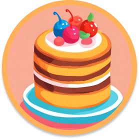

# Bem-vindo(a) ao LingoMingle

Esse é um jogo da memória simples, feito com o intuito de ajudar idosos a aprender vocabulário em inglês

## Como jogar? 

## 3 fases completas

- **Fase 1:** Animais
    - 
    - 
- **Fase 2:** Comidas
    - 
    - 
- **Fase 3:** Roupas
    - 
    - 

<a href="https://memory-game-lyart-sigma.vercel.app/" target="_blank">
    <h2>Jogue Agora!!</h2>
</a>
